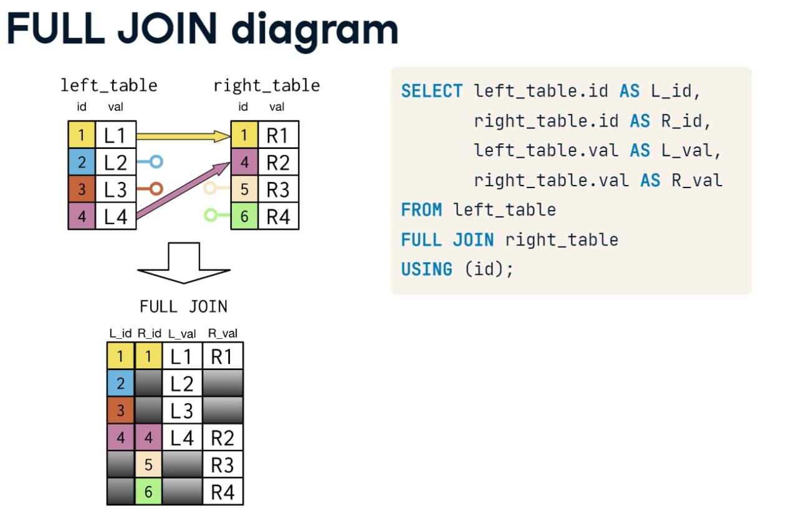

# SQL  Syntax and stuff

---

## Things for managing MySQL database
    show databeses;         // shows databases on the server
    use [database name];    // enters into a database
    create database [name]; // new database
    drop database [name];   // deletes database
    create database [name] character set utf8 collate utf8_general_ci; // database with cyrillic
    show tables from [database]; // a list of tables
    show columns from [table];   // a list of columns with datatypes and other parameters

## Posgress commands
    \connect db_name – підключитись до дб із іменем db_name
    \du – список користувачів
    \dp (або \z) – список таблиць, типів, прав доступа до них
    \dt – список таблиць
    \dt+ — список таблиць з описом
    \dt *s* — список таблиць, що містять s в імені
    \d+ – опис таблиці
    \o – вивести результат у файл
    \l – список баз данных
    \i – ввести данні із файла
    \d “table_name” – опис таблиці
    \i запуск команди із файла, наприклад \i /my/directory/my
    \pset – налаштувати формат виводу
    \echo – виводить повідомленн
    \? – доки psql
    \help – доки SQL

---

## Selecting
#### A basic query
    SELECT [collum] 
    FROM [table];

#### Commenting
    -- comment

#### Picks every column from a table
    SELECT * FROM [table];

#### Aliasing a columns or tables name (for the query result only)
    SELECT MAX(budget) AS max_budget

#### Operators
    =, >, <, >=, <=, <>(!=), AND, OR, IN, BETWEEN, IS NULL, NOT, LIKE

#### CONCAT or || - concantination of columns
    SELECT CONCAT(name, age) FROM TEST_2;

---
## **Filtering**

#### **LIMIT, OFFSET**
LIMIT - gets first x columns \
OFFSET - first row to start selecting

    SELECT * FROM table LIMIT 69;

#### DISTING, DISTING ON
    SELECT DISTINCT collum FROM table; // Picks unique values from a table
    SELECT DISTINCT ON(collum) FROM table; // Picks unique values relative to 1 column

#### Filtering rows usind =, >, <, <=, >=,  LIKE
    SELECT title
    FROM films
    WHERE country = 'China'; 

#### LIKE operator: '%' stands for everything, '_' for a letter
    WHERE name LIKE '%word%';
    WHERE name LIKE '_word';
    WHERE name ILIKE '_word'; // same as like, but register doesn`t metter for it

## Aggregate functions
    AVG() // returns average in the collum
    MAX() // returns max in the collum
    SUM() // returns sum in the collum
    MIN() // returns min in the collum

---
## Sorting and grouping
#### ORDER BY 
    ORDER BY birthdate 	 // sorts in ascending order
    ORDER BY birthdate DESC; // sorts in descending order
    ORDER BY Name ASC, birthdate DESC; // you can filter by many columns with different directions

#### GROUP BY
    GROUP BY [column]

#### HAVING
    // HAVING is WHERE with aggregate functions:
    
    SELECT release_year, COUNT(title)
    FROM films
    GROUP BY release_year
    HAVING COUNT(title) > 200;

**NOTE**: HAVING always comes after GROUP BY

---
## Case syntax

    SELECT name, surface_area,
    CASE WHEN surface_area > 2000000 THEN 'large'
        WHEN surface_area > 350000 THEN 'medium'
        ELSE 'smal' END
        AS geosize_group // will be 3 collums in total

    FROM countries;

---
## JOINS

#### How to reffer to different columns in the query
    table1.name, table2.name

### Inner join

The result table will add all collums from the left_table to the left, and right_table collums to the right
just like concuntination of two strings

### Inner sef-join
is used to compare different rows from one table using some collum (aka some attribute)

**EXAMPLE**: shows change in population between 2010 and 2015

    SELECT p1.country_code,
           p1.size AS size2010,
           p2.size AS size2015
    
    FROM populations as p1		// use different pseudo-names for one table
      INNER JOIN populations as p2
        // when you use only one key, it will make separate rows for each combination, which makes no sence
        ON p1.country_code = p2.country_code 
        // so you need another 
        AND p1.year = p2.year - 5;

### Left Join

Takes every row from the left table, and adds matching rows from right table.
If right table doesn`t have a math for a record, then right columns of resulting record set
as NULL

### Right Join

### Full Join

### Cross Join (Cartesian product for tables)

### Some other variations 

---
## Unions

### Union
Returns union of rows without duplicates

### Union all
Returns union of all the rows (with duplicates)

### Intersect
Returns only unique rows

### Except
returns rows from left table minus rows from right table

    SELECT country_code AS code
    FROM populations
    EXCEPT
    SELECT code
    FROM economies;

---
## Subqueries

Basicaly a SELECT inside of SELECT|FROM|WHERE ect
Simplest subquery

    SELECT name 
    FROM test_2_1 
    WHERE test_2_1.age IN (
        SELECT age 
        FROM test_2_1 WHERE
        test_2_1.name not LIKE 'Abra%'
    );

---
## Functions and proccedures

How you create variables
    
    DECLARE error_msg2 CHAR(50);
    SET error_msg1 = 'Incorrect data';

Basic if/else
    
    IF (condition) THEN
		BEGIN
			...
		END;
	ELSE ...
    END IF;

#### Loops

    Coming soon

#### Basic function exampple 
    DELIMITER || 
    CREATE FUNCTION `tickets_by_passenger`(f_id INT) RETURNS int
    BEGIN
        DECLARE sum INT;
        SELECT SUM(Price) INTO sum FROM ticket WHERE ticket.idPassenger = f_id ;
        RETURN sum;
    END;
    || DELIMITER ;
**NOTE**: *SELECT [clumns..] INTO [variable]* syntax 

DELIMITER || is used ti redefine ; because SQL's parser is really supid and can't 
understand that ; inside of function doesn't mark the end of entire function

#### Basic procedure exampple
    
    Coming soon

---
## Transactions

Transaction help you run multiple commands as it is one, meaning that in case one of 
them fails, whole transaction is canceled. It`s useful in countless ways.

#### Basic transaction:

    START TRANSACTION;
	INSERT INTO [table] VALUES ( ... );
	INSERT INTO [table] VALUES ( ... );
    COMMIT;

So tranactions is basicaly a shell in which you wrap your commands if you need them run together

You can also ROLLBACK your changes

    START TRANSACTION;
	INSERT INTO [table] VALUES ( ... );
	INSERT INTO [table] VALUES ( ... );
    ROLLBACK;

You can rollback to sertain savepoint too:

    START TRANSACTION;
	INSERT INTO [table] VALUES ( ... );
    SAVEPOINT s1 // that's how you 
	INSERT INTO [table] VALUES ( ... );
    ROLLBACK to s1;

Delete savepoint by:
    
    RELEASE SAVEPOINT [name];

Off this flag if you want your changes to commit only after COMMIT  statement

    SET autocommit=0

Add this between your transactions and they will run one after another automaticaly

    AND CHAIN

Add this after your transaction and it will close your session with the server

    RELEASE    

---
## Triggers

Triggers are some instructions which fire authomaticaly only if specific condition is met.
They can be used for cascade deletion or validaton of some data, that needs to be inserted.

Triggers can fire either **before** or **after** some operation.

#### Basic syntax:
    CREATE TRIGGER [name] 
    [BEFORE | AFTER] [UPDATE | INSERT | DELETE] ON [table]
    FOR EACH ROW
        ...
        do work
        ...

#### Simple cascade deletion example
    CREATE 
    TRIGGER company_info_cascade_delete
    BEFORE DELETE ON transport.company
    FOR EACH ROW
    DELETE FROM transport.company_info WHERE OLD.Company_id = Company_id;

#### Simple data verification example
    DELIMITER //
    CREATE 
    TRIGGER driver_age_checker 
    BEFORE INSERT ON driver
    FOR EACH ROW
    BEGIN
        IF NEW.Age < 21 THEN
            SIGNAL SQLSTATE '45000' SET MESSAGE_TEXT = "Forbidden age!!!";
        END IF;
    END //
    DELIMITER ;   

#### Simple cascade update  example
    DELIMITER //
    CREATE 
    TRIGGER company_cascade_upd
    BEFORE UPDATE ON transport.company
    FOR EACH ROW
    BEGIN
        UPDATE company_info SET license_date = now() WHERE OLD.Company_id = Company_id;
    END //
    DELIMITER ;
Note that NEW.[field] and OLD.[field] is used to accses filde`s state before and after
the action specificly.

#### To delete trigger:

    DROP TRIGGER [name]

---
## Indexes and query performanse analysis
    
    SHOW INDEX FROM [table];     // see the indexes

#### Add new indexes to the table
    
    CREATE INDEX authorINDX3 ON author (authorID, login);

#### It will run your query n times and return avg execution time

    SELECT BENCHMARK [n]
        ...
        query body
        ...

#### Returns a report on how MySQL optimiser runs your query
    EXPLAIN SELECT
        ...
        query body
        ...

This will force MySQL to run query joins as they are written, ignoring optimisator choices
 
    EXPLAIN SELECT STRAIGHT_JOIN

##### Reports columns mean:
    id – порядковий номер директиви SELECT у запиті;
    select_type – тип вибірки (simple, primary, union, subquery, derived, uncachable
    subquery тощо);
    table – назва таблиці, для якої виводиться інформація;
    type – тип з’єднання (system, const, eq_ref, ref, fulltext, range тощо);
    possible_keys – індекси, які наявні у таблиці, і можуть бути використані;
    key – назва індексу, який було обрано для виконання запиту;
    key_len – довжина індекса, який був використаний при виконанні запиту;
    ref – вказує, які рядки чи константи порівнюються зі значенням індекса при відборі;
    rows – (прогнозована) кількість рядків, потрібних для виконання запиту;
    Extra – додаткові дані про хід виконання запиту.

Updates statistics about your query`s performanse which can affect MySQLoptimisator work

    ANALYZE TABLE

---
## CRUD for SQL

    INSERT INTO [table] (name, age) VALUES ('Name', 18);
    SELECT [collum] FROM [table];
    UPDATE test_2 SET name = 'changed', age = -1 WHERE name LIKE 'value%';
    DELETE FROM test_2 WHERE age < 0;